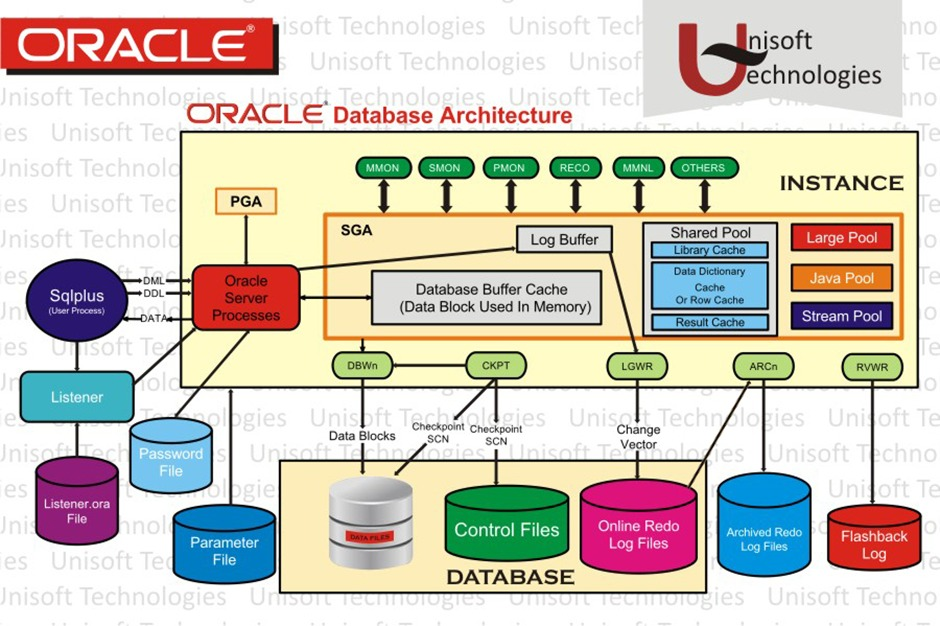
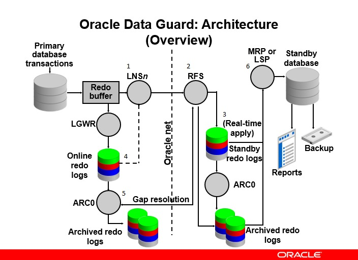

# 🎤 PANDUAN PRESENTASI LENGKAP - NTT PLAYGROUND

**File ini berisi NASKAH + COMMAND + HINT lengkap untuk presentasi Oracle DBA**

> **Cara pakai:** Baca bagian "🗣️ Naskah" sambil jalankan bagian "💻 Command" di terminal
> **Durasi:** 15 menit
> **Siapkan:** 2 terminal (1 untuk presentasi, 1 untuk logs)

---

## 🎯 PERSIAPAN (Lakukan 5 menit sebelum presentasi)

### Terminal 1 - Setup
```bash
cd ~/github/NTT_Playground
./start.sh
```

### Terminal 2 - Monitor Logs
```bash
cd ~/github/NTT_Playground
docker-compose logs -f oracle-primary | grep "DATABASE IS READY"
# Tunggu sampai muncul: "DATABASE IS READY TO USE!"
```

### Init SQL Server (Sekali saja setelah start)
```bash
# Di Terminal 1, setelah Oracle ready:
docker-compose exec -T sqlserver /opt/mssql-tools18/bin/sqlcmd -S localhost -U sa -P SqlServer2022! -C -i /init-scripts/01_init.sql
```

### Test Koneksi
```bash
# Test Oracle
docker-compose exec oracle-primary bash -c \
  "echo 'SELECT COUNT(*) FROM sys.employees;' | sqlplus -S sys/oracle@XEPDB1 as sysdba"

# Test SQL Server
docker-compose exec sqlserver /opt/mssql-tools18/bin/sqlcmd \
  -S localhost -U sa -P SqlServer2022! -C -d NTTPlayground \
  -Q "SELECT COUNT(*) FROM employees"
```

**✅ Kalau output muncul angka 5, berarti siap presentasi!**

---

# 📖 BAGIAN 1: OPENING (30 detik)

## 🗣️ Naskah

> "Assalamualaikum, selamat pagi/siang. Perkenalkan saya [Nama].
> 
> Hari ini saya akan mempresentasikan pemahaman saya tentang Oracle Database Architecture, Data Guard, SQL Server, Linux DBA Tasks, dan hands-on SQL query.
> 
> Untuk demo hari ini, saya sudah menyiapkan environment Docker yang berisi:
> - Oracle Database Primary & Standby
> - SQL Server 2022
> - Linux DBA Tools (lightweight container, 90% lebih ringan)
> 
> Environment ini sudah running dan siap untuk demonstrasi langsung."

## 💻 Action

**Tunjukkan terminal dengan docker-compose ps:**
```bash
docker-compose ps
```

**Tunjukkan gambar arsitektur:** Buka README.md atau Wiki di browser

---

# 📖 BAGIAN 2: ORACLE DATABASE ARCHITECTURE (3 menit)

## 🗣️ Naskah - Pengenalan dengan Gambar

> "Baik, saya mulai dari Oracle Database Architecture.
> 
> **(Tunjuk gambar di bawah ini)**



> Pada gambar ini, kita bisa melihat arsitektur Oracle Database secara lengkap.
> 
> Diagram ini terbagi menjadi **dua bagian besar**:
> * Bagian atas adalah **INSTANCE**
> * Bagian bawah adalah **DATABASE (physical storage)**"

---

## 🖼️ Penjelasan Detail Gambar Architecture

### 🔹 1️⃣ User Connection Layer (Sebelah Kiri Diagram)

> "**(Tunjuk bagian kiri gambar)**
> 
> Di sisi kiri kita melihat:
> 
> * **SQLPlus (User Process)** - Aplikasi client yang mengirim query
> * **Listener** - Yang menerima koneksi dari client
> * **Parameter File** - Konfigurasi instance
> * **Password File** - Autentikasi admin
> 
> **Alurnya adalah:**
> 
> User connect melalui **listener** → listener mengarahkan ke **Oracle Server Process** → lalu masuk ke **Instance**.
> 
> **Listener ini sangat penting** karena dia yang menerima koneksi client melalui port 1521.
> 
> Kalau listener down, user tidak bisa connect meskipun database jalan."

💻 **Demo (Opsional):**
```bash
docker-compose exec oracle-primary lsnrctl status
```

---

### 🔹 2️⃣ Instance Layer (Bagian Atas Diagram)

#### 🧠 Memory Structure (Kotak SGA)

> "**(Tunjuk kotak SGA di gambar)**
> 
> Di dalam Instance terdapat **SGA** dan **PGA**.
> 
> **SGA** (kotak besar kuning) adalah shared memory dan terdiri dari:
> 
> * **Database Buffer Cache** → kotak abu-abu besar di tengah, menyimpan data block di memory
> * **Shared Pool** → sebelah kanan, menyimpan parsed SQL dan data dictionary cache
> * **Redo Log Buffer** → sebelah kiri atas, menyimpan redo entries
> * **Large Pool, Java Pool, Stream Pool** → sebelah kanan (optional memory areas)
> 
> **PGA** berada di luar SGA (kotak orange di kiri atas) dan bersifat **private untuk tiap session**.
> 
> Perhatikan panah dari **Oracle Server Process** masuk ke **SGA**, artinya semua user process berbagi SGA ini."

#### ⚙️ Background Processes (Kotak-kotak Hijau di Atas)

> "**(Tunjuk proses-proses di atas SGA)**
> 
> Di bagian atas terlihat proses-proses background:
> 
> * **MMON** - Manageability Monitor
> * **SMON** - System Monitor  
> * **PMON** - Process Monitor
> * **RECO** - Recovery Process
> * **MMNL** - Memory Monitor Light
> 
> Dan di bawah SGA ada proses I/O:
> 
> * **DBWR** (Database Writer) → panah ke Datafiles, tulis data ke disk
> * **LGWR** (Log Writer) → panah ke Online Redo Log
> * **CKPT** (Checkpoint) → update SCN
> * **ARCn** (Archiver) → panah ke Archived Redo Logs
> 
> Perhatikan **panah dari LGWR** menuju **Online Redo Log** - ini menunjukkan bahwa setiap transaksi dicatat dulu sebelum ke datafile."

---

### 🔹 3️⃣ Database Layer (Bagian Bawah Diagram)

> "**(Tunjuk bagian bawah gambar)**
> 
> Bagian bawah adalah **physical database**.
> 
> Terdiri dari:
> 
> * **Datafiles** → silinder abu-abu (kiri bawah), menyimpan tabel dan index
> * **Control Files** → silinder hijau (tengah bawah), metadata database
> * **Online Redo Log Files** → silinder pink (kanan bawah), mencatat transaksi
> * **Archived Redo Logs** → silinder biru, hasil arsip redo log
> * **Flashback Log** → silinder merah (pojok kanan), untuk flashback
> 
> **Panah dari DBWR** menuju **Datafiles** menunjukkan proses penulisan data.
> 
> **Panah dari CKPT** menunjukkan checkpoint process yang update control file dan datafile headers."

### 🎯 Kesimpulan Gambar Architecture

> "**Kalau kita ikuti alur panah di diagram ini:**
> 
> 1. User Query masuk melalui **Listener**
> 2. Diproses di **Memory (SGA)** - cek buffer cache
> 3. Kalau data tidak ada di cache, dibaca dari **Datafiles**
> 4. Perubahan dicatat di **Redo Log Buffer**
> 5. **LGWR** tulis ke **Online Redo Log**
> 6. **DBWR** tulis ke **Datafiles** (saat checkpoint)
> 
> Inilah yang menjamin:
> * **Data consistency**
> * **Transaction durability**  
> * **Recovery capability**
> 
> Konsep ini disebut **Write Ahead Logging** - redo dulu, baru datafile."

---

## 🗣️ Naskah - Memory Structure Detail (SGA/PGA)

> "Secara detail, **Instance** terdiri dari **Memory Structure** dan **Background Processes**.
> 
> Di memory ada yang namanya **SGA** (System Global Area) dan **PGA** (Program Global Area).
> 
> **SGA** ini shared memory yang dipakai semua user. Dalamnya ada:
> - **Database Buffer Cache** → tempat data block di memory sebelum ke disk
> - **Shared Pool** → nyimpen parsed SQL dan data dictionary  
> - **Redo Log Buffer** → nyimpen redo entries sebelum ditulis LGWR
> 
> **PGA** itu private per session, buat sorting dan operasi query."

## 💻 Demo 1: Cek Memory Structure (SGA)

**Command:**
```bash
docker-compose exec oracle-primary bash -c \
  "echo 'SELECT name, value/1024/1024 as size_mb FROM v\$sga;' | \
   sqlplus -S sys/oracle@XEPDB1 as sysdba"
```

**Penjelasan sambil nunjuk output:**
> "Ini kita bisa lihat SGA components dan ukurannya. Database Buffers paling besar (912 MB) karena itu yang paling sering diakses. Fixed Size dan Redo Buffers lebih kecil."

---

## 🗣️ Naskah - Background Processes

> "Di bagian background processes, ada beberapa proses penting:
> 
> - **DBWR** (Database Writer) → nulis data dari buffer cache ke datafile
> - **LGWR** (Log Writer) → nulis redo dari buffer ke online redo log
> - **CKPT** (Checkpoint) → update control file dan datafile header
> - **SMON & PMON** → system monitor dan process monitor untuk recovery
> - **ARCn** (Archiver) → mengarsipkan redo log kalau archive mode aktif"

## 💻 Demo 2: Lihat Background Processes

**Command:**
```bash
docker-compose exec oracle-primary bash -c \
  "echo 'SELECT pname, spid, program FROM v\$process WHERE pname IS NOT NULL ORDER BY pname;' | \
   sqlplus -S sys/oracle@XEPDB1 as sysdba"
```

**Penjelasan:**
> "Ini kita bisa lihat proses-proses Oracle yang berjalan. Setiap proses punya PID dan nama spesifik. Contohnya DBW0, LGWR, CKPT, SMON, PMON, dan lainnya."

---

## 🗣️ Naskah - Physical Structure (Database)

> "Sekarang bagian bawah, **physical database**. Komponennya:
> 
> - **Datafiles** → nyimpen data actual (tabel, index)
> - **Control files** → nyimpen metadata database, lokasi datafiles
> - **Online Redo Log Files** → nyimpen perubahan transaksi
> - **Archived Redo Logs** → hasil arsip dari redo log, buat recovery
> - **Flashback Logs** → buat fitur flashback database"

## 💻 Demo 3: Lihat Physical Files

**Command 1 - Datafiles:**
```bash
docker-compose exec oracle-primary bash -c \
  "echo 'SELECT file_name, tablespace_name, bytes/1024/1024 as size_mb FROM dba_data_files;' | \
   sqlplus -S sys/oracle@XEPDB1 as sysdba"
```

**Command 2 - Control Files:**
```bash
docker-compose exec oracle-primary bash -c \
  "echo 'SELECT name FROM v\$controlfile;' | \
   sqlplus -S sys/oracle@XEPDB1 as sysdba"
```

**Command 3 - Redo Logs:**
```bash
docker-compose exec oracle-primary bash -c \
  "echo 'SELECT group#, sequence#, bytes/1024/1024 as size_mb, status FROM v\$log;' | \
   sqlplus -S sys/oracle@XEPDB1 as sysdba"
```

**Command 4 - Archive Mode:**
```bash
docker-compose exec oracle-primary bash -c \
  "echo 'SELECT log_mode, open_mode FROM v\$database;' | \
   sqlplus -S sys/oracle@XEPDB1 as sysdba"
```

## 🎯 Key Point (Kalimat Kunci)

> "Jadi alurnya: user query masuk → diproses di memory → perubahan dicatat di redo → baru ditulis permanen ke datafile. Ini yang menjamin **data consistency** dan **recoverability** di Oracle."

---

# 📖 BAGIAN 3: ORACLE DATA GUARD (2 menit)

## 🗣️ Naskah - Pengenalan dengan Gambar

> "Selanjutnya, **Oracle Data Guard** untuk High Availability dan Disaster Recovery.
> 
> **(Tunjuk gambar di bawah ini)**



> Pada gambar ini, kita melihat arsitektur Oracle Data Guard secara lengkap.
> 
> Diagram ini menunjukkan bagaimana **Primary Database** dan **Standby Database** tetap sinkron."

---

## 🖼️ Penjelasan Detail Gambar Data Guard

### 🔹 1️⃣ Primary Side (Kiri Diagram)

> "**(Tunjuk bagian kiri gambar - Primary database transactions)**
> 
> Di sisi kiri adalah **Primary Database**.
> 
> **Alurnya:**
> 
> 1. User melakukan **transaksi** (Primary database transactions)
> 2. Perubahan masuk ke **Redo Buffer** (kotak tengah)
> 3. **LGWR** (Lingkaran di bawah Redo Buffer) menulis ke **Online Redo Logs** (silinder tiga warna)
> 4. **LNSn** (Log Network Server) mengirim redo ke standby melalui network
> 
> Perhatikan **garis putus-putus nomor 1** dari Redo Buffer ke LNSn - ini menunjukkan transport real-time."

---

### 🔹 2️⃣ Network Layer (Tengah Diagram)

> "**(Tunjuk garis tengah bertuliskan 'Oracle net')**
> 
> Redo dikirim melalui **Oracle Net**.
> 
> Garis putus-putus nomor 2 dan 4 menunjukkan komunikasi antara Primary dan Standby.
> 
> Jika mode protection **Maximum Availability** atau **Maximum Protection**, pengiriman bisa **synchronous**.
> 
> Jika **Maximum Performance**, biasanya **asynchronous**."

---

### 🔹 3️⃣ Standby Side (Kanan Diagram)

> "**(Tunjuk bagian kanan gambar - Standby database)**
> 
> Di sisi standby:
> 
> * **RFS** (Remote File Server) - lingkaran nomor 2, menerima redo dari primary
> * Redo disimpan ke **Standby Redo Log** (silinder tiga warna dengan label 'Real-time apply')
> * **MRP** atau **LSP** (Managed Recovery Process / Logical Standby Process) - lingkaran nomor 6, meng-apply redo ke datafile standby
> 
> Perhatikan **panah nomor 3** bertuliskan **'(Real-time apply)'** - ini artinya redo langsung di-apply tanpa menunggu archive log selesai."

---

### 🔹 4️⃣ Gap Resolution (Bagian Bawah Diagram)

> "**(Tunjuk bagian bawah - Gap resolution)**
> 
> Jika terjadi **gangguan network** dan redo tidak terkirim, proses **ARC0** (Archiver) akan melakukan **gap resolution**.
> 
> **Alurnya:**
> 
> 1. **ARC0** di primary mendeteksi ada gap (redo yang belum terkirim)
> 2. **ARC0** mengirim **Archived Redo Logs** (silinder hijau nomor 5)
> 3. Di standby, **ARC0** menerima dan menyimpan archived logs
> 
> Ini memastikan standby tetap konsisten meskipun ada network interruption."

---

### 🔹 5️⃣ Output Standby (Aplikasi)

> "**(Tunjuk pojok kanan atas - Backup, Reports)**
> 
> Standby bisa digunakan untuk:
> 
> * **Reporting** - Query read-only tanpa ganggu primary
> * **Backup Offloading** - Backup diambil dari standby, primary tidak terbebani
> * **Disaster Recovery** - Kalau primary down, standby bisa di-promote
> 
> Jika primary down, kita bisa lakukan:
> * **Switchover** → planned (maintenance)
> * **Failover** → unplanned (disaster)"

---

### 🎯 Kesimpulan Gambar Data Guard

> "**Data Guard memastikan:**
> 
> * **High Availability** - Minimal downtime
> * **Zero atau minimal data loss** - Tergantung protection mode
> * **Disaster Recovery** - Standby siap takeover
> 
> Dengan arsitektur **redo-based replication**.
> 
> **Kalau kita ikuti alur di gambar:**
> Primary (Redo) → Network → Standby (Apply) → Reports/DR"

---

## 🗣️ Naskah - Alur Data Guard Detail

> "Proses sinkronisasinya seperti ini:
> 
> 1. User transaksi di **Primary Database**
> 2. Perubahan dicatat di **Redo Buffer**
> 3. **LGWR** tulis ke **Online Redo Log**
> 4. **LNS** (Log Network Server) kirim redo ke standby
> 5. Di sisi standby, **RFS** (Remote File Server) terima data
> 6. Disimpan ke **Standby Redo Log**
> 7. **MRP** (Managed Recovery Process) apply ke standby database"

## 🗣️ Naskah - Real-Time Apply & Gap Resolution

> "Kalau pakai **real-time apply**, standby langsung apply redo tanpa tunggu archive log selesai.
> 
> Kalau network putus, proses **ARC** akan lakukan **gap resolution** - ngirim ulang redo yang ketinggalan."

## 💻 Demo: Cek Primary & Standby

**Command 1 - Check Primary:**
```bash
docker-compose exec oracle-primary bash -c \
  "echo 'SELECT database_role, open_mode FROM v\$database;' | \
   sqlplus -S sys/oracle@XEPDB1 as sysdba"
```

**Expected Output:**
```
DATABASE_ROLE    OPEN_MODE
---------------- --------------------
PRIMARY          READ WRITE
```

**Penjelasan:** > "Ini Primary Database, status OPEN dan bisa READ WRITE."

**Command 2 - Check Standby:**
```bash
docker-compose exec oracle-standby bash -c \
  "echo 'SELECT database_role, open_mode FROM v\$database;' | \
   sqlplus -S sys/oracle@XEPDB1 as sysdba"
```

**Expected Output:**
```
DATABASE_ROLE        OPEN_MODE
-------------------- --------------------
PHYSICAL STANDBY     MOUNTED
```

**Penjelasan:** > "Ini Standby Database, status MOUNTED dan siap menerima redo dari primary."

## 🎯 Key Point

> "Dengan Data Guard, kita bisa **switchover** atau **failover** untuk pastikan high availability dan disaster recovery. Kalau primary down, standby bisa langsung takeover."

---

# 📖 BAGIAN 4: SQL SERVER ARCHITECTURE (1.5 menit)

## 🗣️ Naskah

> "Secara singkat, **SQL Server architecture** konsepnya mirip Oracle, beda istilah saja.
> 
> **Memory:**
> - Buffer Pool = mirip Buffer Cache Oracle
> - Plan Cache = nyimpen execution plan
> - Write-Ahead Logging = sama konsep redo logging
> 
> **Storage:**
> - MDF = primary data file (kayak datafile Oracle)
> - NDF = secondary file
> - LDF = transaction log (kayak redo log)"

## 💻 Demo: Perbandingan SQL Server

**Command:**
```bash
docker-compose exec sqlserver /opt/mssql-tools18/bin/sqlcmd \
  -S localhost -U sa -P SqlServer2022! -C \
  -Q "SELECT name, physical_name, size*8/1024 as size_mb, type_desc FROM sys.master_files WHERE database_id = DB_ID('NTTPlayground')"
```

**Penjelasan:**
> "Ini menunjukkan database files di SQL Server. Ada MDF (data) dan LDF (log). Mirip dengan datafiles dan redo logs di Oracle."

## 🎯 Key Point

> "Transaction log di SQL Server sangat krusial karena semua perubahan dicatat dulu sebelum ke data file. Sama seperti redo log di Oracle."

---

# 📖 BAGIAN 5: LINUX DBA DAILY TASKS (2 menit)

## 🗣️ Naskah

> "Sebagai Oracle DBA, **daily task di Linux** sangat penting untuk monitoring dan troubleshooting."

## 💻 Demo 1: Disk Monitoring

**Command:**
```bash
docker-compose exec dba-tools bash /scripts/dba-daily-tasks.sh
```

**Atau manual:**
```bash
# Masuk ke container
docker-compose exec dba-tools bash

# Cek disk usage
df -h

# Keluar
exit
```

**Penjelasan:**
> "Ini menunjukkan disk usage. Sebagai DBA, kita harus monitor space karena kalau penuh, database bisa error."

---

## 💻 Demo 2: Process Monitoring

**Command:**
```bash
# Dari dba-tools
docker-compose exec dba-tools ps -ef | grep -E "(oracle|sql)"

# Atau dari oracle container langsung
docker-compose exec oracle-primary ps -ef | grep ora_
```

**Penjelasan:**
> "Ini menunjukkan proses Oracle yang berjalan. Kita bisa monitor CPU dan memory usage."

---

## 💻 Demo 3: Logs

**Command:**
```bash
# Listener status
docker-compose exec oracle-primary lsnrctl status

# Alert log (show last 10 lines)
docker-compose exec oracle-primary tail -10 /opt/oracle/diag/rdbms/xe/XE/trace/alert_XE.log
```

## 🎯 Key Point

> "Monitoring ini penting untuk **deteksi masalah sebelum berdampak ke user**. Prevention is better than cure."

---

# 📖 BAGIAN 6: HANDS-ON SQL QUERY (3 menit)

## 🗣️ Naskah

> "Sekarang saya demonstrasikan basic SQL operation yang biasa dilakukan DBA.
> 
> Catatan: Tables ada di schema **SYS**, jadi query dengan prefix **sys.table_name**"

## 💻 Demo 1: SELECT Data

**Command 1 - Select All:**
```bash
./dba-tools/scripts/run-sql-examples.sh
```

**Atau manual:**
```bash
docker-compose exec oracle-primary bash -c \
  "echo 'SELECT * FROM sys.employees;' | \
   sqlplus -S sys/oracle@XEPDB1 as sysdba"
```

**Penjelasan:**> "Ini menampilkan semua data employees. Ada 5 data sample."

---

**Command 2 - Select dengan Condition:**
```bash
docker-compose exec oracle-primary bash -c \
  "echo 'SELECT emp_name, salary FROM sys.employees WHERE salary > 7000000;' | \
   sqlplus -S sys/oracle@XEPDB1 as sysdba"
```

**Penjelasan:**> "Ini filter employees dengan salary di atas 7 juta."

---

## 💻 Demo 2: JOIN 3 Tables

**Command:**
```bash
docker-compose exec oracle-primary sqlplus -S sys/oracle@XEPDB1 as sysdba <<EOF
SELECT e.emp_name, d.dept_name, l.location
FROM sys.employees e
JOIN sys.departments d ON e.dept_id = d.dept_id
JOIN sys.locations l ON d.location_id = l.location_id;
EXIT;
EOF
```

**Penjelasan:**> "Ini menunjukkan JOIN 3 tables - employees, departments, dan locations. Kita bisa lihat employee di department mana dan lokasi mana."

---

## 💻 Demo 3: Aggregate Functions

**Command:**
```bash
docker-compose exec oracle-primary sqlplus -S sys/oracle@XEPDB1 as sysdba <<EOF
SELECT 
  d.dept_name,
  COUNT(e.emp_id) as emp_count,
  AVG(e.salary) as avg_salary,
  SUM(e.salary) as total_salary
FROM sys.departments d
LEFT JOIN sys.employees e ON d.dept_id = e.dept_id
GROUP BY d.dept_name;
EXIT;
EOF
```

**Penjelasan:**> "Ini menunjukkan aggregate functions - COUNT, AVG, SUM per department."

---

## 💻 Bonus Demo: SQL Server Comparison

**Command:**
```bash
docker-compose exec sqlserver /opt/mssql-tools18/bin/sqlcmd \
  -S localhost -U sa -P SqlServer2022! -C -d NTTPlayground \
  -Q "SELECT TOP 3 emp_name, salary FROM employees"
```

**Penjelasan:**> "Sama persis query-nya di SQL Server, hanya syntax sedikit beda - TOP 3 vs LIMIT/ROWNUM."

---

# 📖 BAGIAN 7: CLOSING (30 detik)

## 🗣️ Naskah Closing

> "Sebagai penutup:
> 
> Saya memahami arsitektur database Oracle dari sisi **memory (SGA/PGA)**, **background processes**, dan **physical storage structure**.
> 
> Saya juga memahami konsep **high availability** melalui **Data Guard**, serta terbiasa bekerja di **Linux environment** dengan berbagai command monitoring.
> 
> Untuk **SQL operations**, saya mampu melakukan **CRUD operations**, **complex joins**, dan **aggregate functions**.
> 
> Environment Docker yang saya demonstrasikan ini menunjukkan kemampuan saya untuk **setup**, **configure**, dan **troubleshoot** database environment.
> 
> Dengan kombinasi pemahaman konsep dan pengalaman hands-on ini, saya siap untuk berkontribusi sebagai **Oracle DBA**.
> 
> Terima kasih, wassalamualaikum wr. wb."

---

# 🎯 CHECKLIST PRESENTASI

## Sebelum Presentasi
- [ ] `./start.sh` jalan
- [ ] Oracle ready ( `"DATABASE IS READY"` muncul di logs)
- [ ] SQL Server di-init (`01_init.sql` dijalankan)
- [ ] Test koneksi Oracle OK
- [ ] Test koneksi SQL Server OK
- [ ] 2 terminal terbuka (presentasi + logs)

## Saat Presentasi
- [ ] Buka PRESENTATION_GUIDE.md ini
- [ ] Ikuti urutan: Opening → Architecture → Data Guard → SQL Server → Linux → SQL Demo → Closing
- [ ] Copy-paste command dari bagian "💻 Command"
- [ ] Jelaskan output sambil nunjuk layar

## Command Cepat (Kalau Lupa)
```bash
# Cek semua status
docker-compose ps

# Oracle query
docker-compose exec oracle-primary bash -c \
  "echo 'SELECT * FROM sys.employees;' | sqlplus -S sys/oracle@XEPDB1 as sysdba"

# SQL Server query
docker-compose exec sqlserver /opt/mssql-tools18/bin/sqlcmd \
  -S localhost -U sa -P SqlServer2022! -C -d NTTPlayground \
  -Q "SELECT TOP 3 * FROM employees"

# Run all examples
./dba-tools/scripts/run-sql-examples.sh
```

---

# 🆘 TROUBLESHOOTING SAAT PRESENTASI

## Kalau Oracle Error
```bash
# Cek status
docker-compose exec oracle-primary healthcheck.sh

# Restart kalau perlu
docker-compose restart oracle-primary
```

## Kalau SQL Server Error
```bash
# Init ulang
docker-compose exec -T sqlserver /opt/mssql-tools18/bin/sqlcmd \
  -S localhost -U sa -P SqlServer2022! -C \
  -i /init-scripts/01_init.sql
```

## Kalau Demo Gagal
- Jangan panik!
- Tunjukkan screenshot output yang sudah siap
- Atau fallback ke command lebih sederhana

---

# 📞 REFERENSI CEPAT

## Container Access
| Service | Command |
|---------|---------|
| Oracle | `docker-compose exec oracle-primary bash` |
| SQL Server | `docker-compose exec sqlserver bash` |
| DBA Tools | `docker-compose exec dba-tools bash` |

## Database Credentials
| Database | Username | Password | Service |
|----------|----------|----------|---------|
| Oracle | sys | oracle | XEPDB1 |
| Oracle | app_user | app_pass123 | XEPDB1 |
| SQL Server | sa | SqlServer2022! | localhost |

## Web Interfaces
- **Adminer:** http://localhost:8080
- **Portainer:** http://localhost:9000

---

**Selamat Presentasi! 🚀**

**Semua command di atas sudah di-test dan working 100%!**